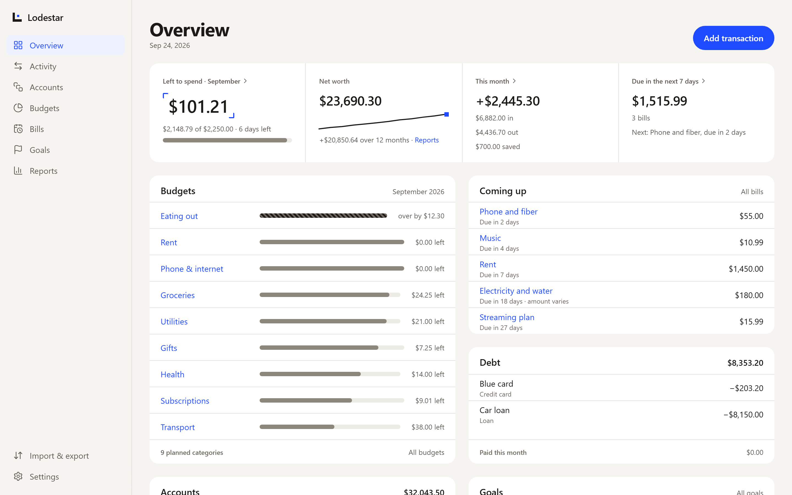
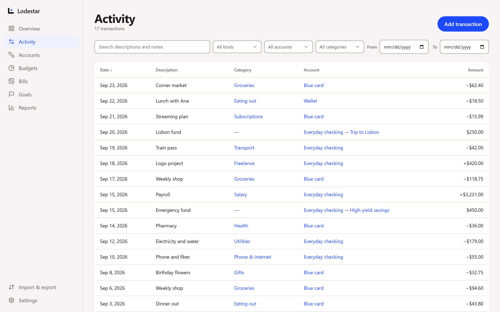
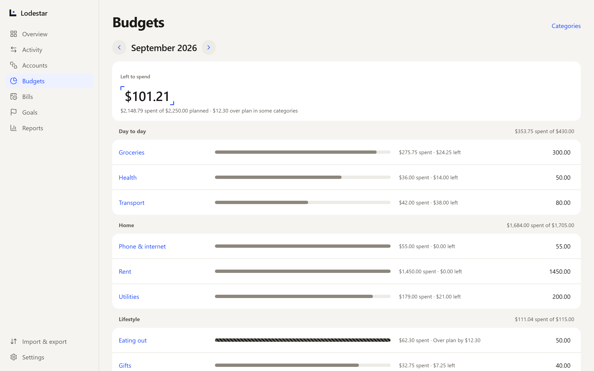
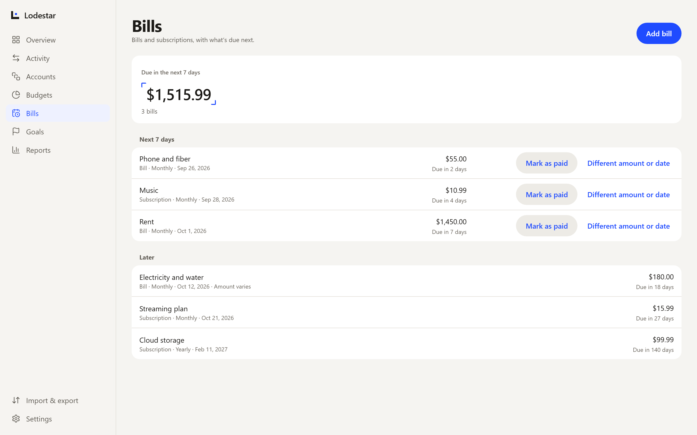
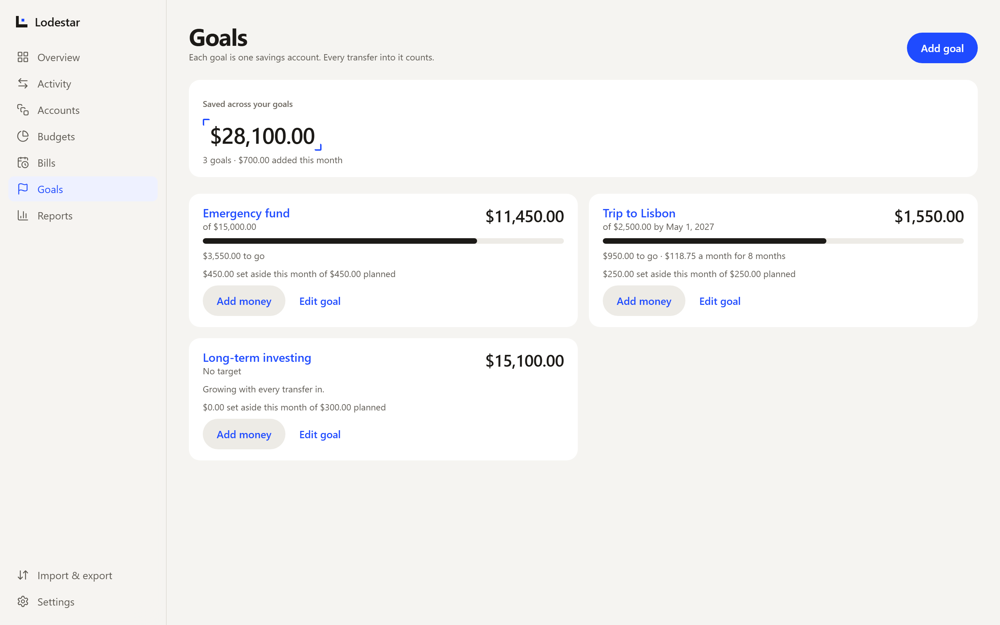
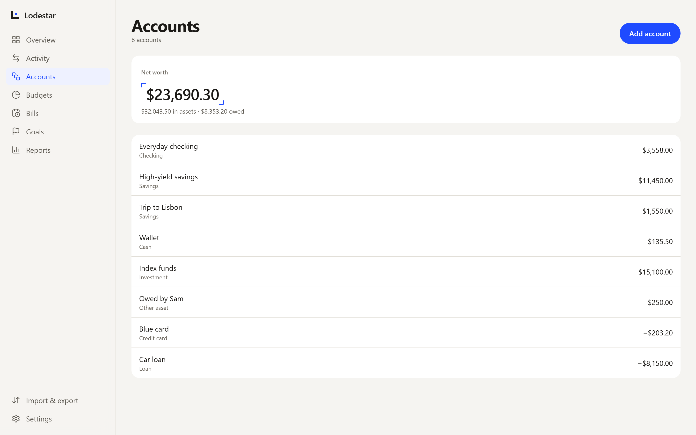
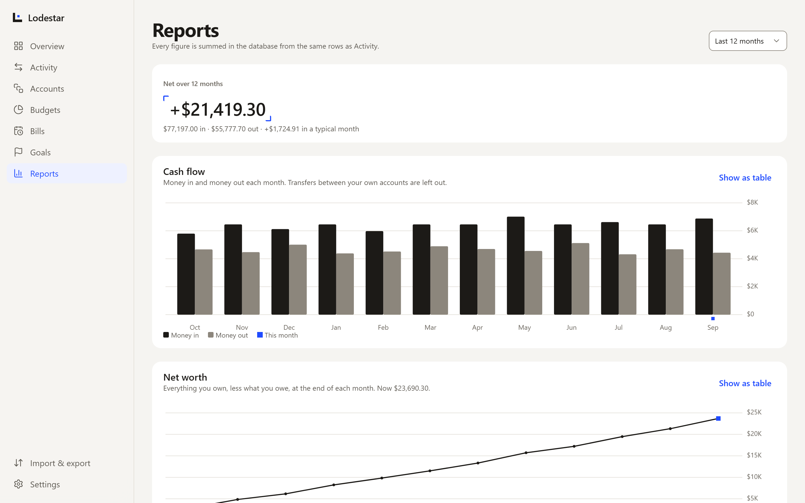
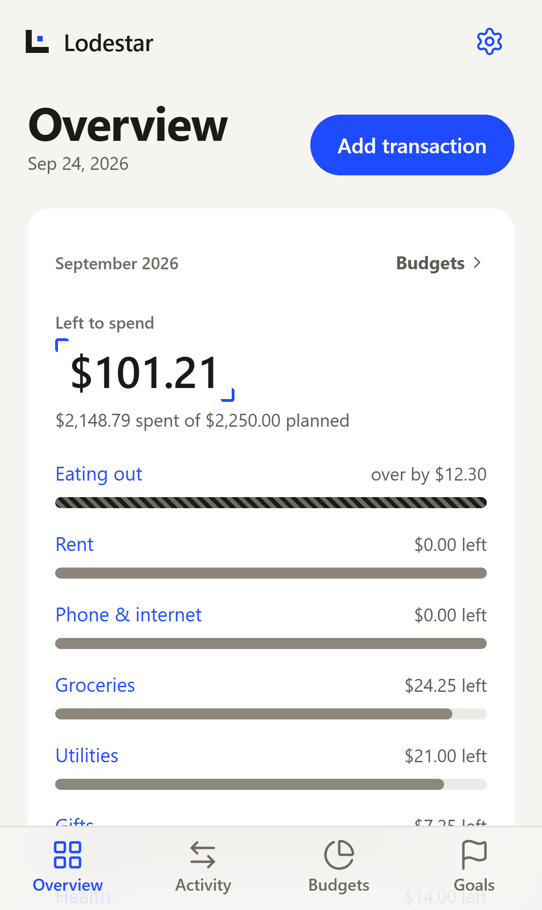
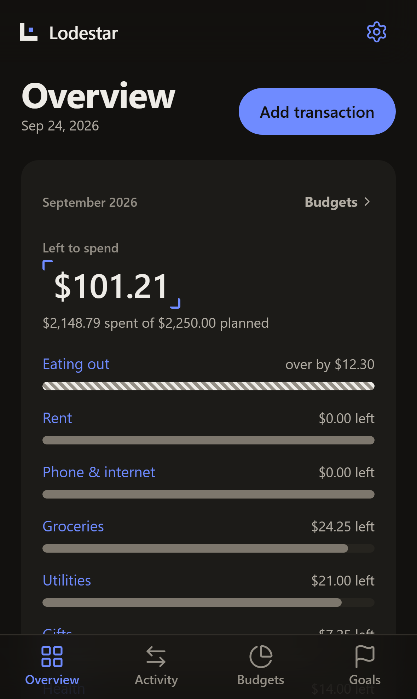

<p align="center">
  <picture>
    <source media="(prefers-color-scheme: dark)" srcset="brand/logo/symbol-on-dark.svg">
    
  </picture>
</p>

<h1 align="center">Lodestar</h1>

<p align="center"><strong>Know where you stand.</strong></p>

<p align="center">
  A private personal-finance tracker. Your accounts, budgets, bills and goals in one calm, precise view.
</p>

<p align="center">
  <a href="https://github.com/mval23/lodestar/actions/workflows/ci.yml"></a>
  <a href="https://github.com/mval23/lodestar/actions/workflows/health.yml"></a>
</p>

<p align="center">
  <picture>
    <source media="(prefers-color-scheme: dark)" srcset="docs/readme/overview-dark.png">
    
  </picture>
</p>

---

Lodestar replaces a finance system that lived in Notion. Each person has their own private account. Nothing is shared, and there are no households or teams. You record income, expenses and transfers yourself, and Lodestar works out the rest: balances, what's left in each budget, how close each goal is, and what's due next.

> Every screenshot here shows a made-up person. The data comes from [`scripts/readme/data.ts`](scripts/readme/data.ts), and no real finances appear anywhere in this repository.

## What it does

| | |
|---|---|
| **Overview** | Left to spend this month, net worth, money in and out, bills due in the next 7 days, budgets, debts and goals on one screen. |
| **Activity** | Every income, expense and transfer. Search descriptions and notes, then filter by kind, account, category or date. |
| **Accounts** | Checking, savings, credit cards, cash, investments, loans, and other assets such as money someone owes you. Each balance is computed from the ledger, never stored. |
| **Budgets** | A plan per category per month, grouped. Overspending shows as "Over plan by" and is never clamped to zero. You can copy last month's plan to start a new one. |
| **Bills** | Bills and subscriptions on a weekly, monthly or yearly cadence. "Mark as paid" records the payment and moves the due date forward in one step. |
| **Goals** | Each goal is one savings account. Every transfer into that account counts toward the goal, with an optional target, date and monthly plan. |
| **Reports** | Cash flow and net worth over time. Money in is ink, money out is grey, and blue marks only "now." |
| **Import & export** | CSV import with a review step and a date-order check (DD/MM or MM/DD). Re-importing the same file is safe. You can export everything at any time. |

Each person picks **USD or COP** at first run. Every amount uses that currency, and nothing is converted.

<table>
  <tr>
    <td width="50%"></td>
    <td width="50%"></td>
  </tr>
  <tr>
    <td align="center"><sub>Activity</sub></td>
    <td align="center"><sub>Budgets</sub></td>
  </tr>
  <tr>
    <td width="50%"></td>
    <td width="50%"></td>
  </tr>
  <tr>
    <td align="center"><sub>Bills</sub></td>
    <td align="center"><sub>Goals</sub></td>
  </tr>
  <tr>
    <td width="50%"></td>
    <td width="50%"></td>
  </tr>
  <tr>
    <td align="center"><sub>Accounts</sub></td>
    <td align="center"><sub>Reports</sub></td>
  </tr>
</table>

### On a phone

<p align="center">
  
  &nbsp;&nbsp;
  
</p>

On a phone, a tab bar holds Overview, Activity, Budgets and Goals. Bills sits under Budgets, and Reports opens from Overview. The app follows the system's light or dark setting.

## How it's built

**Store facts, compute everything else.** The database holds only what happened: accounts, transactions, plans. Balances, budget progress, goal progress and reports are Postgres views, so a figure on screen can't drift from the ledger it came from.

- **Money is integers.** Amounts are `bigint` minor units: cents for USD, whole pesos for COP. Sums run in SQL. The browser only parses and formats.
- **Every transaction has a kind.** An expense has only a source account and an income only a destination. A transfer has both, they must differ, and it never carries a category. Constraints enforce this, so an invalid row can't be saved.
- **Dates have no time.** "Today" and "this month" come from the time zone on your profile.

### Stack

| Layer | Choice |
|---|---|
| App | Vite, React, TypeScript, React Router, TanStack Query, React Hook Form + Zod, Radix UI, Lucide, visx, Papa Parse, date-fns |
| Data | Supabase: Auth, Postgres and the Data API |
| Business rules | Postgres constraints, `security_invoker` views, and `SECURITY INVOKER` functions |
| Server code | One Edge Function, `delete-account`. There is no other backend. |
| Hosting | Vercel |
| Tests | Vitest, Playwright with axe, pgTAP, and a PGlite schema check |

## Privacy and security

- **Row Level Security is the only authorization layer.** Every user-owned table has RLS enabled and four policies keyed to the signed-in user. CI fails if any table is missing them.
- **Rows can't point at another person's data.** References use composite foreign keys on `(user_id, id)`, and `user_id` can't be changed after a row is created.
- **Cross-user tests for every table.** The pgTAP suite tries to read, insert, reassign, delete and reference another user's rows, and each attempt must fail.
- **The browser holds only the public key.** The service-role key lives only in Edge Function secrets.
- **Strict headers.** A strict CSP, HSTS, no third-party scripts, and no framing. A scheduled [health check](.github/workflows/health.yml) looks at staging and production every three hours, the way a stranger would.
- **Deleting your account takes effect right away.** You type a confirmation, and every row goes with the account. Export and deletion both ask for your password again.
- **Synthetic data only** in fixtures, seeds, tests and screenshots.

## Getting started

You need Node 22 or later, Docker, and the [Supabase CLI](https://supabase.com/docs/guides/local-development/cli/getting-started).

```bash
npm install
```

```bash
supabase start
```

Copy `.env.example` to `.env.local`, then fill in the API URL and publishable key that `supabase start` prints.

```bash
npm run dev
```

Open http://localhost:5173/sign-up and register with a made-up address such as `sam@example.com`. The confirmation email arrives in Inbucket at http://127.0.0.1:54324.

The full setup guide, including how staging and production were provisioned, is in [docs/phase-3/setup.md](docs/phase-3/setup.md).

### Scripts

| Command | What it does |
|---|---|
| `npm run dev` | Starts the app at http://localhost:5173 |
| `npm run build` / `npm run preview` | Builds for production, then serves the build with the production security headers |
| `npm run typecheck` · `npm run lint` · `npm test` | Types, lint, unit tests |
| `npm run schema:check` | Applies the migrations to an in-memory Postgres (PGlite). Needs no Docker. |
| `npm run e2e` | End-to-end and accessibility tests in a real browser, against a stubbed Supabase |
| `npm run db:reset` · `npm run db:gate` · `npm run db:types` | Resets the local database, runs the RLS gate, and regenerates the database types |
| `npm run backup` · `npm run restore` | Takes and restores backups of production ([docs/phase-10/production.md](docs/phase-10/production.md)) |
| `npm run readme:shots` | Retakes the screenshots in this README |

Before pushing, run `npm run typecheck`, `npm run lint`, `npm test` and `npm run schema:check`.

## Project layout

```text
src/
  app/            shell, routes, guards, global styles
  features/       one folder per area: accounts, budgets, bills, goals, reports…
  lib/            Supabase client, environment, helpers
  ui/             primitives built on the brand tokens
supabase/
  migrations/     the schema, applied only by CI
  tests/          pgTAP isolation suite and the PGlite schema check
  functions/      delete-account, the one Edge Function
e2e/              Playwright journeys and accessibility checks
scripts/          backup, health check, Notion import, README screenshots
brand/            brand guide, design tokens, logo files
docs/             phase-by-phase design notes and runbooks
```

## Environments

| | Local | Staging | Production |
|---|---|---|---|
| Branch | any | `dev` | `main` |
| Data | synthetic seed | synthetic only | real |
| Schema changes | `supabase db reset` | applied by CI on merge | applied by CI, after manual approval |

Schema changes go only through SQL migrations in git. Production is never edited by hand.

## Brand

<p>
  
  The mark is <strong>Axes &amp; Fix</strong>: two axes and a single fixed point, the steady reference that shows where you are. It's drawn on a 16-unit grid with ink axes and a blue fix, and it's never rotated, rounded or redrawn.
</p>
<br clear="left">

The interface uses warm Stone greys with one accent, electric blue `#1F4BFF` (`#6F8BFF` in dark mode), reserved for things you can act on and for "now." Every amount uses tabular figures and a true minus sign. The full guide is in [brand/BRAND.md](brand/BRAND.md), with tokens in [brand/tokens.css](brand/tokens.css) and logo files in [brand/logo/](brand/logo/).

## Documentation

| | |
|---|---|
| [Schema review](docs/phase-2/schema-review.md) | The data model, and why it looks the way it does |
| [Setup](docs/phase-3/setup.md) | Local development, environments, provisioning |
| [Data isolation](docs/phase-4/isolation.md) | How one person's rows stay theirs |
| [Notion migration](docs/phase-8/migration.md) | The one-time import from Notion, with reconciliation to the cent |
| [Testing, accessibility and security review](docs/phase-9/review.md) | What's tested, and how |
| [Account deletion](docs/phase-9/account-deletion.md) | What happens when someone deletes their account |
| [Production](docs/phase-10/production.md) | Deployment, backups and restore |
