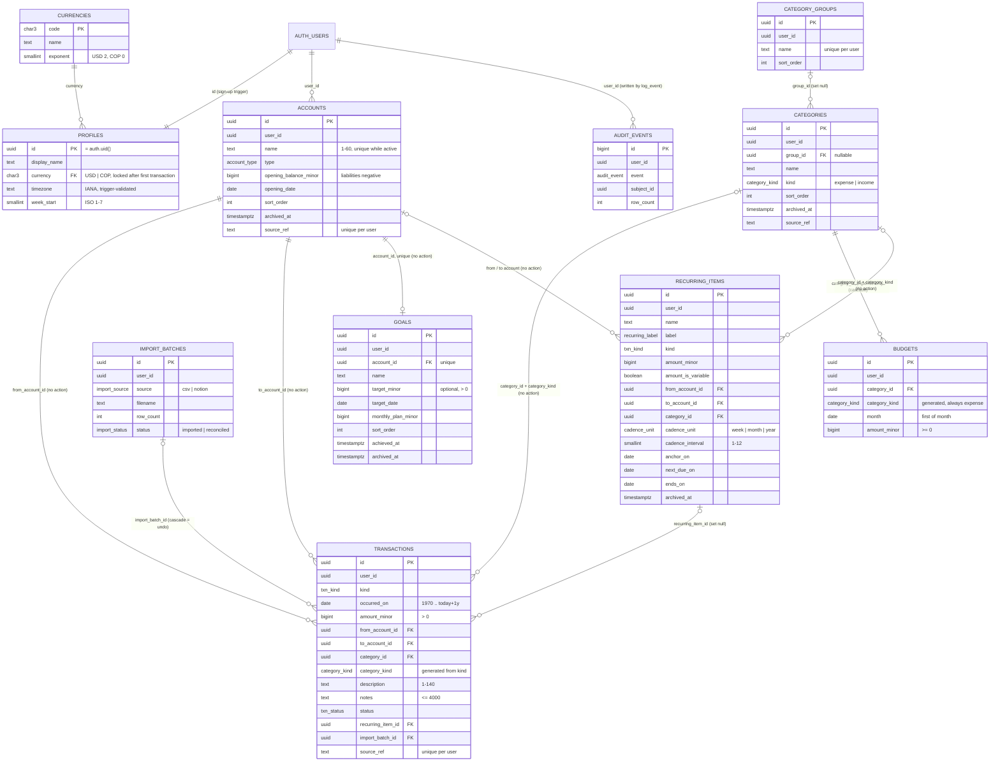

# Lodestar schema review (Phase 2)

Peer-review packet for the initial database schema. Phase 2 is done when this ERD and the DDL pass review.

| | |
|---|---|
| Migration | `supabase/migrations/20260919000000_initial_schema.sql` |
| RLS gate (CI) | `supabase/tests/rls_gate.sql` |
| Smoke harness | `supabase/tests/check-schema.mjs` (`npm install`, then `npm run schema:check`) |
| Target | Supabase Postgres 17 |
| Sources | `CLAUDE.md` (binding), approved proposal sections 15–17 |
| Harness result | **140 passed, 0 failed** (PGlite 0.3.16, PostgreSQL 17.5) |

Suggested reading order: the ERD, the "Look here first" list, the rule-enforcement table, then the questions at the end.

## Look here first

1. **Category kind is enforced by foreign keys.** `transactions`, `recurring_items` and `budgets` each have a `category_kind` column. It is a stored generated column: derived from `kind` in transactions and recurring items, and the constant `'expense'` in budgets. Each FK is `(user_id, category_id, category_kind) → categories(user_id, id, kind)`. MATCH SIMPLE skips the FK when `category_kind` is null (transfers), so the `*_category_on_transfer_check` constraints close that gap.
2. **The CI gate needs no allowlist.** Every public table has exactly one policy per command for `authenticated`. When a command is not allowed, the table still has an explicit policy with `using (false)` or `with check (false)`, and there is no grant for that command. This covers `currencies` (read-only), `profiles` (no client insert or delete) and `audit_events` (append-only through `log_event`).
3. **INSERT and UPDATE grants are column-level.** Clients can never write `user_id`. `id`, `source_ref` and `created_at` are never updatable. The trigger `prevent_owner_change` rejects any change to `user_id`, including from the table owner or a superuser. The proposal only asked for column-level UPDATE grants, so column-level INSERT grants are an addition.
4. **"Restrict" is written as `ON DELETE NO ACTION`** (the Postgres default): a referenced row cannot be deleted while references remain, and the check runs at the end of the statement. Deleting a user from `auth.users` cascades through all ten tables in one statement, and the harness verifies it.
5. **The audit log has no free-form metadata.** `audit_events` stores `event` (a fixed enum), `subject_id uuid` and `row_count int`, so an amount or a description cannot be stored in it. This replaces the proposal's `metadata` column.
6. **Recurrence is always measured from the anchor.** `recurrence_next(anchor, unit, interval, after)` returns the first `anchor + n × interval` date after `after`. Month-end dates therefore clamp without drift: Jan 31 → Feb 28 → Mar 31.
7. **All grants are revoked from `service_role`**, not just from `anon`. The only server code (`delete-account`) calls the Auth admin API and never touches public tables. See question 3.

## Entity relationship diagram

Every user-owned table also has `user_id → auth.users(id) on delete cascade`, `created_at` and `updated_at`. Those lines are omitted to keep the diagram readable. All references between user rows are composite `(user_id, x_id)`.

## Tables

| Table | Holds | Keys and uniqueness | Delete behavior |
|---|---|---|---|
| `currencies` | USD (exponent 2), COP (exponent 0) | PK `code` | Read-only for `authenticated`; no writes from the app |
| `profiles` | Display name, currency, time zone, week start | PK `id` = `auth.users.id` | Created by `handle_new_user`; deleted by the `auth.users` cascade only |
| `accounts` | Where money lives, opening balance | `unique (user_id, id)`; `unique (user_id, lower(name)) where archived_at is null`; `unique (user_id, source_ref)` | Blocked while transactions, recurring items or a goal reference it; otherwise hard delete. Archive via `archived_at` |
| `category_groups` | Report groupings | `unique (user_id, lower(name))` | Categories become ungrouped (`set null (group_id)`) |
| `categories` | Expense or income classification | `unique (user_id, id, kind)` (FK target); `unique (user_id, kind, lower(name))` | Blocked while transactions or recurring items use it; budgets cascade. Archive, or use `merge_categories` |
| `transactions` | One row per money event | `unique (user_id, source_ref) where source_ref is not null` | Hard delete. Deleting its import batch deletes it |
| `budgets` | Plan per expense category per month | `unique (user_id, category_id, month)` | Hard delete |
| `goals` | Savings target on exactly one fund account | `unique (account_id)` | Hard delete; archive on completion |
| `recurring_items` | Bills, subscriptions, regular income and transfers | `(user_id, next_due_on)` index | Hard delete keeps past transactions (`set null (recurring_item_id)`) |
| `import_batches` | One row per CSV or Notion import | — | Deleting the batch deletes its transactions (undo and migration rollback) |
| `audit_events` | Export, import, bulk delete, account deletion requested | identity PK | No client delete; removed only by the account cascade |

Enums: `account_type` (checking, savings, credit_card, cash, investment, loan, other_asset), `txn_kind`, `txn_status`, `category_kind`, `cadence_unit`, `recurring_label`, `import_source`, `import_status`, `audit_event`. Liabilities are `credit_card` and `loan` (`is_liability()`).

### Views (all `security_invoker = true`)

| View | Computes |
|---|---|
| `account_entries` | One signed row per account side of each transaction (+ into `to`, − out of `from`). Used as a building block |
| `account_balances` | `opening + money in − money out`, plus `cleared_balance_minor` (pending excluded) and `is_liability`. The only balance source |
| `budget_progress` | Planned, spent (expenses in that category and month only) and left (`planned − spent`, may be negative) |
| `monthly_cash_flow` | Money in (income), money out (expenses) and net, per calendar month. Transfers excluded |
| `goal_progress` | Fund balance, `remaining_minor` (target − balance, may be negative), this month's contributions (transfers into the fund account). "This month" comes from `profiles.timezone` |
| `net_worth_by_month` | Assets, liabilities and net worth at each month end, from first activity through the current month in the profile's time zone |
| `category_usage` | Last use and use count per category, for pickers ordered by recent use |

### Functions

| Function | Security | Behavior |
|---|---|---|
| `mark_bill_paid(item_id, paid_on default null, amount_minor default null)` | invoker | Locks the item, inserts the transaction (description = item name), advances `next_due_on` from the anchor. One database transaction. `paid_on` defaults to today in the profile's time zone. Refuses archived items |
| `copy_budgets(from_month, to_month)` | invoker | Inserts missing rows only (`on conflict do nothing`), skips archived categories, returns the count |
| `import_transactions(batch jsonb, rows jsonb)` | invoker | Creates the batch, inserts rows with `on conflict (user_id, source_ref) do nothing`, logs an `import` event and returns `(batch_id, inserted_count, duplicate_count)`. Every row needs a `source_ref`. Takes 1 to 20,000 rows. Any invalid row aborts the whole call |
| `merge_categories(source_id, target_id)` | invoker | Same kind only. Moves transactions and recurring items, adds the source's budgets into the target's for the same months, deletes the source |
| `recurrence_next(anchor, unit, interval, after)` | invoker, immutable | Next grid date after `after` |
| `is_liability(account_type)` | invoker, immutable | `credit_card` or `loan` |
| `log_event(event, subject_id default null, row_count default null)` | **definer** | Writes one audit row for `auth.uid()`. Fails when not signed in |
| `handle_new_user()` | **definer**, trigger on `auth.users` | Creates the profile. Metadata `display_name` and `timezone` are optional, and an unknown time zone falls back to UTC instead of failing sign-up |

All functions use `set search_path = ''` with fully qualified names. EXECUTE is revoked from `PUBLIC`, `anon` and `service_role`, and granted to `authenticated` only on the RPCs listed above.

## How each CLAUDE.md rule is enforced

| Rule | Mechanism | Object |
|---|---|---|
| Every record belongs to one user | `user_id uuid not null default auth.uid() references auth.users on delete cascade` | every user-owned table |
| RLS on, four policies for `authenticated` keyed to `(select auth.uid())` | policies | `<table>_select_own`, `_insert_own`, `_update_own`, `_delete_own` |
| No grants to `anon` | `revoke all ... from anon`; default privileges revoked for future objects | migration "Table privileges" section; gate rule 4 |
| Cross-user references impossible | composite FKs to `unique (user_id, id)` | `*_account_fkey`, `*_category_fkey`, `transactions_recurring_item_fkey`, `transactions_import_batch_fkey`, `categories_group_fkey`, `goals_account_fkey` |
| `user_id` never updatable | column-level INSERT/UPDATE grants + trigger | `prevent_owner_change` (`<table>_owner_immutable`) |
| Only two SECURITY DEFINER functions | code + CI gate rule 6 | `handle_new_user`, `log_event` |
| RPCs are SECURITY INVOKER with `search_path = ''` | function definitions | all RPCs |
| Views use `security_invoker` | view options + gate rule 5 | all seven views |
| CI fails without RLS or four policies | gate | `supabase/tests/rls_gate.sql` |
| Money is `bigint` minor units | column types | every `*_minor` column |
| One currency per user; USD or COP | FK to `currencies`; profile holds it, accounts don't | `profiles.currency` |
| Currency changeable only with no transactions | trigger | `profiles_currency_lock` → `enforce_currency_lock()` |
| Valid IANA time zone | trigger against `pg_timezone_names` (a CHECK cannot hold a subquery) | `profiles_timezone_valid` |
| "Today" and "this month" from the profile time zone | `now() at time zone profiles.timezone` | `goal_progress`, `net_worth_by_month`, `mark_bill_paid`, `check_occurred_on_upper_bound` |
| `occurred_on` is a date, 1970 to today + 1 year | CHECK (lower bound) + trigger (upper bound) | `transactions_occurred_on_lower_bound`, `transactions_occurred_on_upper_bound` |
| Explicit `kind`, direction check | CHECK | `transactions_direction_check`, `recurring_items_direction_check` |
| `amount_minor > 0` | CHECK | `transactions_amount_positive`, `recurring_items_amount_positive` |
| Transfers never carry a category | CHECK | `transactions_category_on_transfer_check`, `recurring_items_category_on_transfer_check` |
| Category of matching kind | generated `category_kind` + 3-column FK | `transactions_category_fkey`, `recurring_items_category_fkey` |
| Categories are expense or income only | enum | `category_kind` |
| Budgets reference expense categories only | constant generated column + FK | `budgets_category_fkey` |
| Budget `month` is the first of a month | CHECK | `budgets_month_first_day` |
| One budget per category per month | unique | `budgets_category_month_key` |
| Left may go negative | computed, never clamped | `budget_progress.left_minor` |
| Goal has exactly one fund account | `not null` + unique | `goals_account_id_key` |
| Contributions are transfers into the goal account | computed | `goal_progress.this_month_contributed_minor` |
| Cadence week/month/year, interval 1–12, month-end clamping | enum, CHECK, function | `cadence_unit`, `recurring_items_interval_range`, `recurrence_next` |
| `mark_bill_paid` is atomic | one plpgsql function (one transaction), `for update` on the item | `mark_bill_paid` |
| Imports are idempotent | unique partial index + `on conflict do nothing` | `transactions_source_ref_key`, `import_transactions` |
| Balance is a view | no stored balance column | `account_balances` |
| Archive accounts with history; hard delete otherwise | FK `no action` blocks deleting referenced accounts | `transactions_from_account_fkey`, `transactions_to_account_fkey` |
| Archive or merge used categories | FK `no action` + RPC | `transactions_category_fkey`, `merge_categories` |
| Audit export, import and bulk delete without amounts or descriptions | fixed enum, structured columns, select-own only, `false` write policies | `audit_events`, `log_event` |
| Account deletion cascades all rows | `on delete cascade` from `auth.users` on every table | tested in harness |
| `created_at` and `updated_at` on every table | columns + trigger | `set_updated_at()` (`<table>_set_updated_at`) |
| Description 1–140 characters | CHECK (length ≤ 140 and not blank) | `transactions_description_length` |

## Deviations from and additions to the proposal

| Item | Proposal | Schema | Reason |
|---|---|---|---|
| `audit_events` payload | `metadata` | `subject_id uuid`, `row_count int` | Structured columns can't hold amounts or descriptions |
| `audit_events` time | `occurred_at` | `created_at` (plus `updated_at`) | CLAUDE.md: every table has `created_at` and `updated_at`. Rows are never updated |
| `profiles.negative_style` | present | dropped | CLAUDE.md requires a true minus sign for negatives, so there is nothing to choose |
| `profiles.currency` | chosen at first run | `not null default 'USD'` | Avoids a profile with no currency. First run confirms or changes it, which is allowed until the first transaction |
| `profiles.week_start` | unspecified | ISO 1–7, default Monday | Explicit domain |
| `import_batches` counts | "counts" | `row_count` only | Rows inserted are `count(transactions)` for the batch (a query). The RPC returns the duplicate count and records the inserted count in the audit row. Storing both would be a rollup |
| `import_batches.status` | "status" | `imported` or `reconciled` | Imports are all-or-nothing, so there is no failed or partial state. `reconciled` records the cutover sign-off |
| Uncategorized income and expenses | "a category of the matching kind otherwise" | `category_id` nullable for income and expenses | CSV rows and 3 Notion expenses have no category. See question 1 |
| INSERT grants | not specified | column-level; `user_id` excluded everywhere | A client cannot even submit a `user_id`; the default is always the caller |
| `created_at` on insert | "Created time → created_at" | insertable on `transactions` only | Lets the Notion import keep Notion's created time |
| Updatable budget columns | — | `amount_minor` only | Changing month or category is a different row |
| Updatable goal columns | — | everything except `account_id` | Moving a goal to another account changes its history. Delete the goal and create a new one |
| `category_groups` for income | — | `categories.group_id` nullable, `on delete set null (group_id)` | Income categories usually have no group, and deleting a group should not delete its categories |
| Label and kind of recurring items | — | CHECK: income ⇔ income; `transfer` label ⇒ transfer; subscription ⇒ expense; bill ⇒ expense or transfer | A credit-card bill is a transfer |
| `recurring_items.ends_on` | listed | `mark_bill_paid` still advances past it | "Ended" is a query (`next_due_on > ends_on`), not a flag |
| `service_role` privileges | not specified | revoked on public tables, views and functions | Least privilege; nothing server-side needs them. Question 3 |
| Disallowed commands | "trigger only", "none" | explicit `false` policies, no grant | Uniform gate with no allowlist |
| Gate scope | RLS and four policies | also anon privileges, `security_invoker` views, SECURITY DEFINER allowlist, no `FOR ALL` policies | The same query catches the other ways isolation can fail |
| Additions | — | `account_entries`, `category_usage`, `net_worth_by_month`, `recurrence_next`, `is_liability`, `merge_categories` | Needed by the listed features. Each is small |
| `notes` length | unbounded | ≤ 4000 characters | Bounded input |

## Notion mechanics not carried over

- **Direction inferred from empty relations.** Replaced by `transactions.kind` and a CHECK.
- **Savings categories.** There are none. `category_kind` has only expense and income. Savings are transfers into a goal's account.
- **Stored or rolled-up values:** Current Balance, In Value, Out Value, Spent, Left, Usage and the Type rollup. These are views now.
- **Date flags:** "This Month", "Last month" and "Year". They are computed from `occurred_on` and the profile's time zone.
- **Rounding formulas that hide float noise.** Money is `bigint` minor units.
- **Left clamped at zero.** `left_minor` goes negative.
- **The Summary database, per-account views and linked views.** These are queries and screens, not tables.
- **Templates and buttons stored as data.** Their intent becomes `recurring_items` plus `mark_bill_paid`.
- **The Seldom flag and the tag field.** Neither has a column. The Notion import appends tags to `notes`.
- **An Errors view.** Constraints stop invalid rows from being saved.
- **Number and Old Categories.** These were never used, so they are not migrated.

## Harness

`npm run schema:check` starts Postgres 17.5 in memory (PGlite, WebAssembly). It needs no Docker, psql or Supabase CLI. It stubs the parts of Supabase the migration needs: the `anon`, `authenticated` and `service_role` roles, the `auth` schema, `auth.users`, `auth.uid()` (reads `request.jwt.claim.sub`), the `extensions` schema and Supabase's default grants in `public`. It then applies the migration unchanged as a **non-superuser** owner role, the way Supabase's `postgres` role applies it. Tests switch roles with `set role authenticated` and set the JWT claim for users A and B. All data is synthetic.

Result on 2026-09-19: **140 passed, 0 failed.**

| Group | Passed | Covers |
|---|---|---|
| Setup | 3 | Stubs; migration applies; all relations owned by the non-superuser role |
| RLS gate | 4 | Gate passes, and fails on three negative controls: a table without RLS, a table with only a `FOR ALL` policy, a view without `security_invoker` |
| Sign-up and profiles | 4 | Profile created by trigger; clients cannot insert profiles; IANA check; currencies readable |
| Synthetic data | 4 | Fixtures for A and B |
| Cross-user isolation | 53 | For each of 9 tables, B cannot select, update or delete A's rows or insert with A's `user_id`. The insert is refused by the column grant and, when the harness grants that column inside a rolled-back transaction, by RLS as well. B cannot reassign its own rows to A either. Profiles are covered, and views return only the caller's rows |
| Cross-user foreign references | 5 | B's transaction, budget, goal, category and recurring item cannot point at A's rows; B cannot pay A's bill |
| Transaction rules | 21 | Direction (6 cases), amount, description length, category kind both ways, category on transfer, date bounds, update-time checks, kind change of a used category, budget kind, mid-month and duplicate budgets, recurring rules, one goal per account |
| Ownership immutability | 4 | Column grants on `user_id`, `id`, `source_ref` and `created_at`; the trigger also blocks the table owner and a superuser; `updated_at` is maintained |
| Currency lock | 2 | Change allowed with no transactions, refused with transactions |
| Views | 7 | Balances, cleared balance, net worth by month, cash flow, budget progress (left = −5,550), goal progress, and this month under UTC+14 and UTC−11 |
| Recurrence and `mark_bill_paid` | 7 | Jan 31 → Feb 28 → Mar 31 → Apr 30; leap-year Feb 29; weekly; quarterly; amount override; atomicity (a failed insert leaves the due date and transaction count unchanged); archived items; deleting a bill keeps its transactions |
| `copy_budgets` | 3 | No overwrite; second run inserts 0; only the caller's rows; month validation |
| `import_transactions` | 8 | 3 inserted and 1 duplicate; the second run inserts 0; one bad row aborts everything, leaving no batch; `source_ref` required; no cross-user account references; audited with a count only; deleting the batch undoes the import; only `status` is updatable |
| `merge_categories` | 3 | Moves rows and sums budgets; refuses mixed kinds; refuses other users' categories |
| Audit log | 4 | Always the caller's own id; fixed events only; no client writes; `anon` refused |
| `anon` sees nothing | 3 | Every table and view, writes, and every RPC are refused with "permission denied" |
| Deletion rules | 5 | Accounts with history are blocked; used categories are blocked; a goal's account is blocked; group delete leaves `user_id` intact; deleting an auth user cascades everything and leaves B untouched |

Balance math is checked against hand-computed numbers. Synthetic checking account: 100,000 + 250,000 − 4,550 − 50,000 − 10,000 = 285,450. Card: −20,000 − 3,000 (pending) − 18,000 + 10,000 = −31,000, or −28,000 cleared. Net worth this month is 304,450; last month it was 330,000.

**Mutation check.** To confirm the tests can fail, the migration was weakened four ways and the harness rerun. Removing the transfer-category CHECK failed 8 tests. A permissive `accounts` select policy failed 2. Removing the `anon` revokes failed 3, including the gate. Changing one FK from NO ACTION to RESTRICT passed: the cascade from `auth.users` also works with RESTRICT, so NO ACTION is a convention here, not a fix.

### What the harness cannot validate

- **Supabase itself.** Roles, `auth.uid()` and default grants are stubs based on Supabase's documented behavior, not GoTrue or Supabase's real bootstrap. The first run against `supabase start` or staging in Phase 3 is the real check.
- **Extensions.** PGlite cannot grant CREATE on its own database, so the stub creates `pg_trgm` as the superuser before the migration runs. The migration's `create extension if not exists pg_trgm with schema extensions` is a no-op in the harness. On Supabase, supautils allows `postgres` to create it.
- **PostgREST.** Nothing goes through the Data API. Column-level grants interact with PostgREST upserts (`Prefer: resolution=merge-duplicates` needs UPDATE on every column sent) and with `select=*` on the `returning` side. This needs a check in Phase 3.
- **Concurrency.** PGlite has a single connection. The `for update` lock in `mark_bill_paid` and concurrent imports with overlapping `source_ref`s are not exercised.
- **Performance.** No `EXPLAIN` at realistic volume. The trigram indexes are created but not exercised by a query.
- **Supabase security advisor (splinter).** Not run.
- **pgTAP.** Not available here; the formal suite is Phase 4. The harness checks map one-to-one onto pgTAP tests.
- **Date sensitivity.** Tests use the current UTC date. A run exactly at a UTC month boundary could compute "this month" differently in the harness and the database. This has not been seen in practice.

## Inconsistencies found in CLAUDE.md and the proposal

1. **The currency lock is too narrow.** Currency can change "only while the user has no transactions". But `opening_balance_minor`, budgets, goal targets and recurring amounts are also minor units. Switching USD to COP with an opening balance of 12,345 (meaning $123.45) turns it into COP 12,345. The trigger implements the rule as written. See question 2.
2. **The rule of four policies clashes with read-only and append-only tables.** The proposal gives `currencies` and `audit_events` no insert, update or delete, and gives `profiles` "trigger only" inserts. The explicit `false` policies resolve this.
3. **`negative_style`** (proposal, profiles) contradicts "Negatives use a true minus sign" (CLAUDE.md). Dropped.
4. **Audit "metadata"** (proposal) sits uneasily with "without recording amounts or descriptions" (CLAUDE.md). Resolved with structured columns.
5. **`account_delete_requested`** is an audit event, but account deletion cascades every audit row immediately. The event is gone as soon as it matters. Either drop it, or log it somewhere that outlives the user (which needs a design decision about retention).
6. **Export and bulk-delete auditing can't be enforced by the database.** Export is a series of SELECTs and bulk delete is a DELETE from the browser, so the database only logs them if the client calls `log_event`. With no custom backend, this relies on the app. Only `import` is logged by the database itself, inside the RPC.
7. **The Notion import uses "the same import RPC as CSV", but the migration also creates accounts, categories, groups, goals and budgets.** `import_transactions` covers transactions only. The other rows are ordinary inserts made as the owner: accounts and categories carry `source_ref`, goals are unique per account, and budgets are unique per category and month. Category groups have only their unique name. Re-running that part is safe but not formally idempotent in one call.
8. **"Net worth = sum of non-archived balances"** (proposal) conflicts with a historical net-worth series. An archived account's balance was real in the months it was open. `net_worth_by_month` includes archived accounts, so its current month equals the sum of non-archived balances only when archived accounts are at zero.
9. **Whether expense and income rows must have a category** is ambiguous (see question 1).

## Questions for the reviewer

1. Should income and expense transactions be allowed without a category (current schema: yes)? If not, the Notion import's 3 uncategorized expenses and CSV rows need a category before import, and `category_id` becomes required whenever `kind <> 'transfer'`.
2. Should the currency lock also apply once any account has a non-zero opening balance, or any budget, goal or recurring item exists? The simplest safe rule is "locked once any amount-bearing row exists".
3. Revoking `service_role` from public tables is stricter than Supabase's default. Is any planned tooling (backups, the nightly dump, admin scripts) expected to use `service_role` rather than `postgres`?
4. Should deleting an account that backs a goal delete the goal (cascade) instead of being blocked (current behavior)?
5. Should balances and net worth exclude future-dated transactions? `account_balances` currently includes every transaction, pending or future. `cleared_balance_minor` excludes pending ones only.
6. Should deleting an import batch write a `bulk_delete` audit event automatically? A trigger on `import_batches` could call `log_event`, which stays within the two SECURITY DEFINER functions.
7. Is the label and kind rule for recurring items right (a bill may be an expense or a transfer; a subscription is always an expense)?
8. Is 20,000 rows per `import_transactions` call acceptable? The Notion import is 1,688 rows.
9. For CSV rows, is a hash of the date, amount, description, account and occurrence index within the file acceptable as `source_ref`? Two identical purchases on the same day stay distinct because their occurrence indexes differ, and re-importing the same file stays idempotent.
